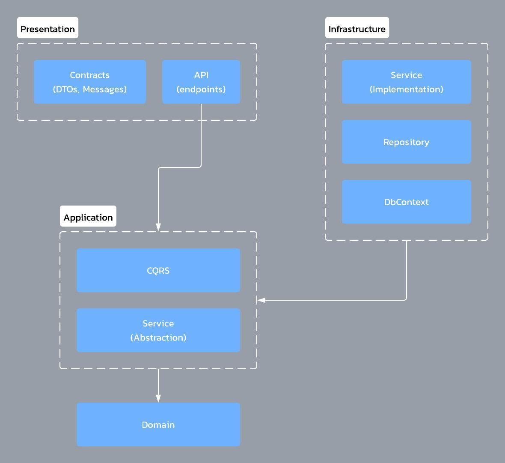
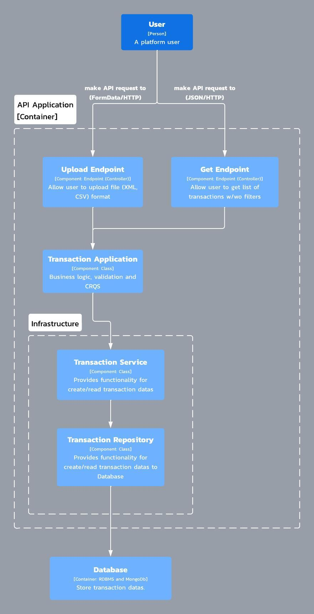
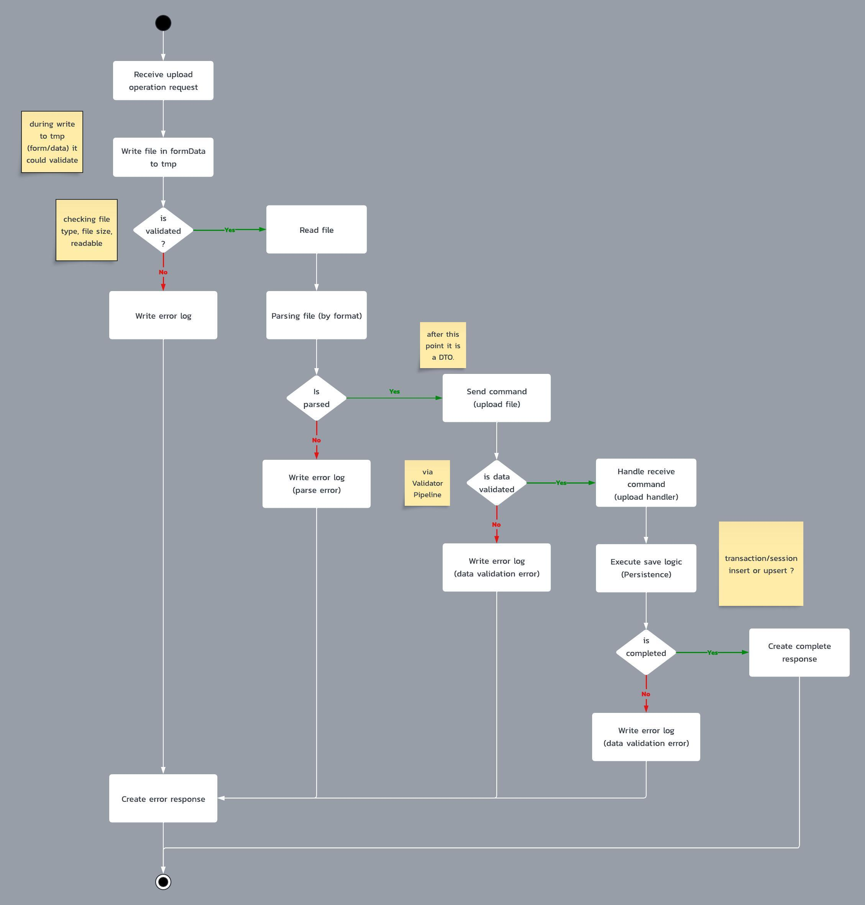
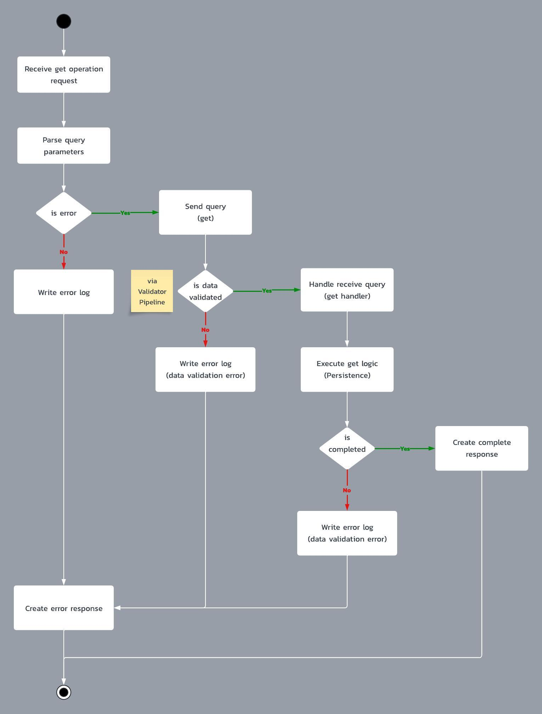
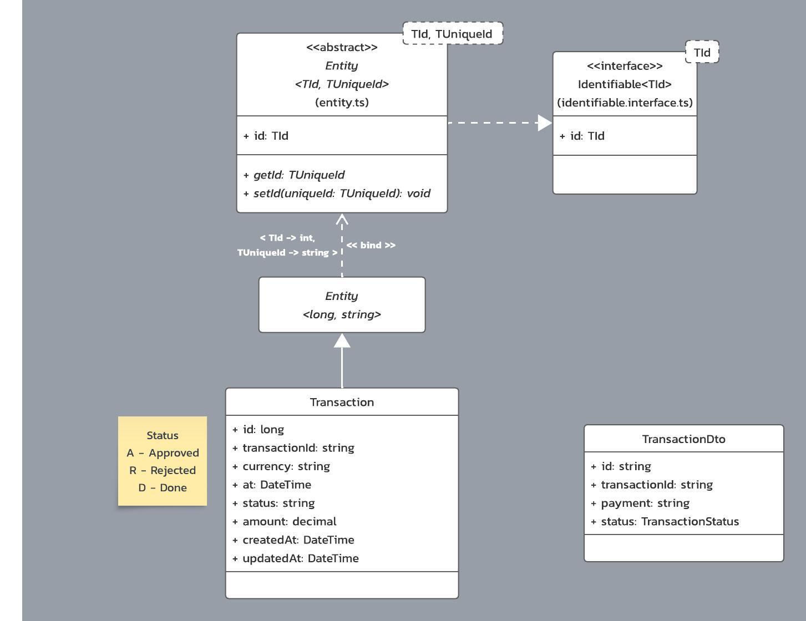
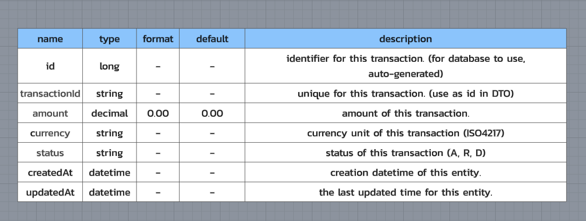
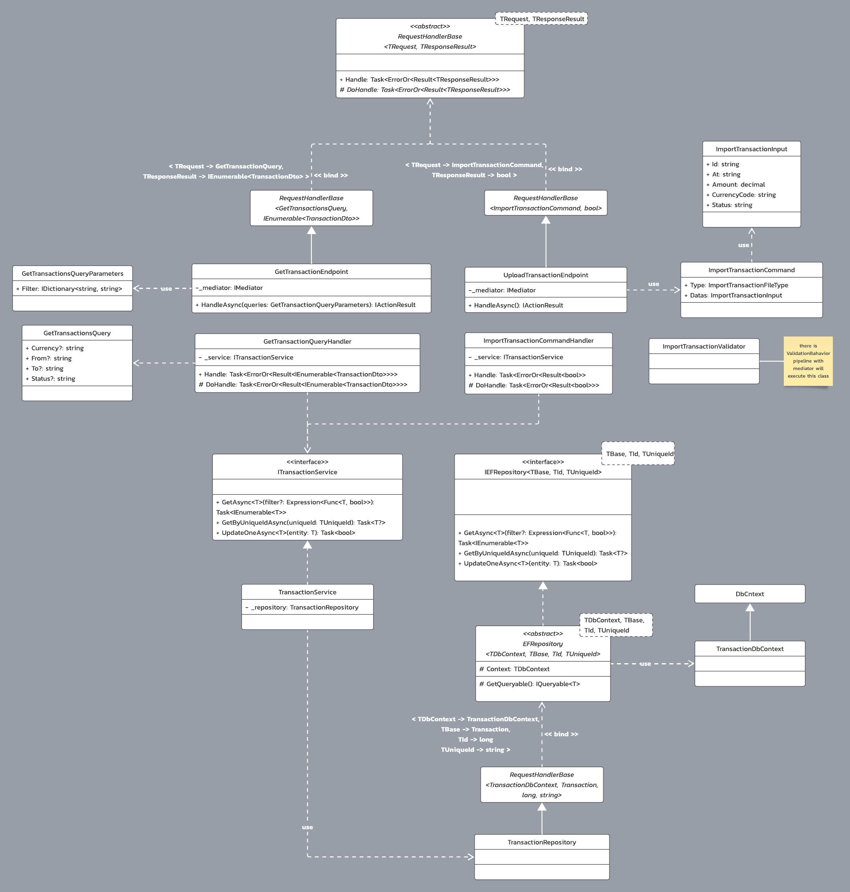

# 2c2p-soft-arch-tech-asgmt

2C2P Software Architect Technical Assignment

This repository includes both front-end (for testing) and backend

- [2c2p-soft-arch-tech-asgmt](#2c2p-soft-arch-tech-asgmt)
  - [Pre-requisites](#pre-requisites)
  - [Architecture](#architecture)
    - [Flowcharts](#flowcharts)
    - [Data](#data)
    - [Class Diagram (Overview)](#class-diagram-overview)
  - [Development](#development)
    - [API](#api)
    - [Web](#web)
    - [Database](#database)
  - [Test](#test)
    - [Endpoints](#endpoints)
      - [Liveness and HealthCheck](#liveness-and-healthcheck)
      - [Upload](#upload)
      - [List Transactions](#list-transactions)

## Pre-requisites

API:

- Database: `PostgreSQL`
- Framework: `.Net 8`

Web: `Next.js`

By default, API will use the database name: `2c2p_soft_arch_tech_asgmt`

Database script: `db/public.sql`

## Architecture

By using `Clean Architecture` concept, the project structure will be listed below

- `Platform.API` - all endpoints (e.g. /upload, /transactions) and its startup code.
- `Platform.Application` - `commands (WRITE)` and `queries (READ)` operation and its handlers, includes validations.
- `Platform.Common` - contain all common component/class/enum that will be use in every projects
- `Platform.Contracts` - DTOs, request inputs are here
- `Platform.Domain` - This domain entity and its abstractions
- `Platform.Infrastructure` - All repositories, migrations, services, database contexts, and database entity configuration are here

By separating it into layers,


Overview


### Flowcharts

Upload logic [here](docs/flowchart_upload.jpeg)


Get Transactions logic [here](docs/flowchart_get-transaction.jpeg)


### Data

Data class diagram and its dictionary

<table>
<tr>
<td>

</td>
<td>

</td>
</tr>
</table>

### Class Diagram (Overview)

</img>
Original image [here](docs/class.jpeg)

## Development

API support configuration of both `appsettings.json` environment variables, and user secrets

```bash
ASPNETCORE_ENVIRONMENT=Development
ASPNETCORE_URLS=http://+:80
Database__ConnectionString='Server=postgresql;Port=5432;Database=2c2p_soft_arch_tech_asgmt;User Id=postgres;Password=password123;'
```

or edit `src/Dev2C2P.Services/Platform/Platform.API/appsettings.json` file

```json
{
  //
  "Database": {
    "ConnectionString": "Server=127.0.0.1;Port=5432;Database=2c2p_soft_arch_tech_asgmt;User Id=postgres;Password=password123;" // ---> Edit this line
  }
  //
}
```

For local development, use `docker-compose` to set the environment by executing the command below.

```bash
# running detach mode
docker compose up -d

# force recreate
docker compose up --force-recreate
```

Services will run on the ports list below:

- API: `5001`
- web: `3000`
- PostgreSQL (DB): `35432`

### API

source for API is in `src/Dev2C2P.Services/Platform/Platform.API`

```bash
# run
dotnet run --project src/Dev2C2P.Services/Platform/Platform.API

# watch mode
dotnet watch --non-interactive --project src/Dev2C2P.Services/Platform/Platform.API
```

### Web

source for Web is in `src/dev2c2p-web`

```bash
# go to directory
cd src/dev2c2p-web

# install
npm install

# run dev mode on port 3001
npm run dev -p 3001
```

### Database

Run migrations from API project

```bash
# Initialize
dotnet ef migrations add InitialTransactionDbContext --context TransactionDbContext --project ../Platform.Infrastructure/Platform.Infrastructure.csproj

# Cleanup
dotnet ef migrations remove --context TransactionDbContext --project ../Platform.Infrastructure/Platform.Infrastructure.csproj

# Update Database
dotnet ef database update --project ../Platform.Infrastructure/Platform.Infrastructure.csproj
```

> By execute above, ignore the error when executing the script.

## Test

Include `postman` file with samples request for testing [here](docs/api.postman_collection.json)
Also, there are request files (required VSCode plugin: `humao.rest-client` to be installed)

### Endpoints

#### Liveness and HealthCheck

See [liveness](requests/liveness.http)
See [hc](requests/hc.http)

#### Upload

Upload sample in request file has an issue, so please use `postman` or from `web` instead.

```js
POST / upload;
```

See [upload](request/upload/upload.http) or [postman](docs/api.postman_collection.json)

#### List Transactions

Get list will apply filter by using query parameter key `filter`

For example,

1. Get Transaction by currency

```js
GET /transactions?filter[currency]=USD
```

2. Get Transaction by currency and status (A - Approved)

```js
GET /transactions?filter[currency]=USD&filter[status]=A
```

3. Get Transaction by range date

```js
GET /transactions?filter[from]=2019-01-24 15:00:00&filter[to]=2019-01-24 17:00:00
```

See [transaction](request/transactions/get.http)
